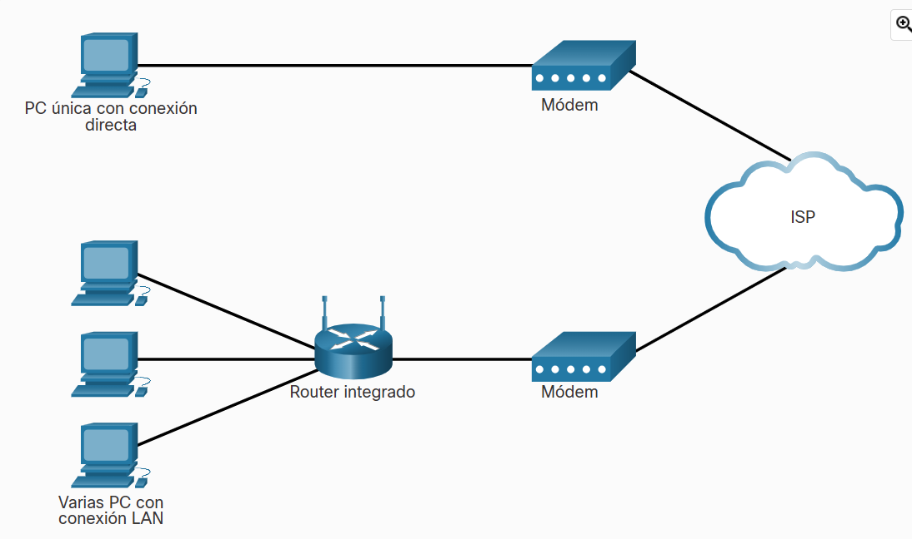
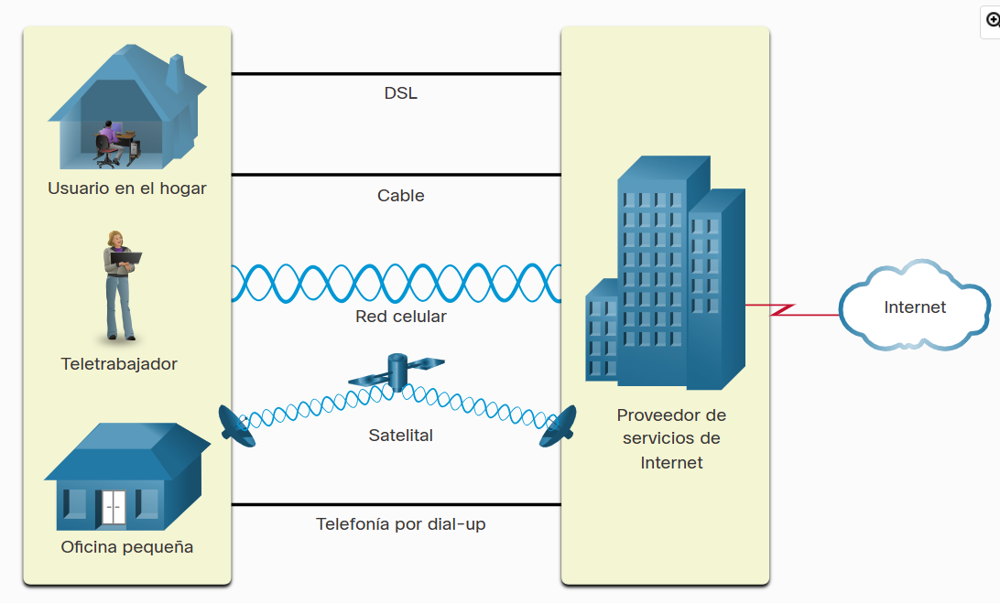
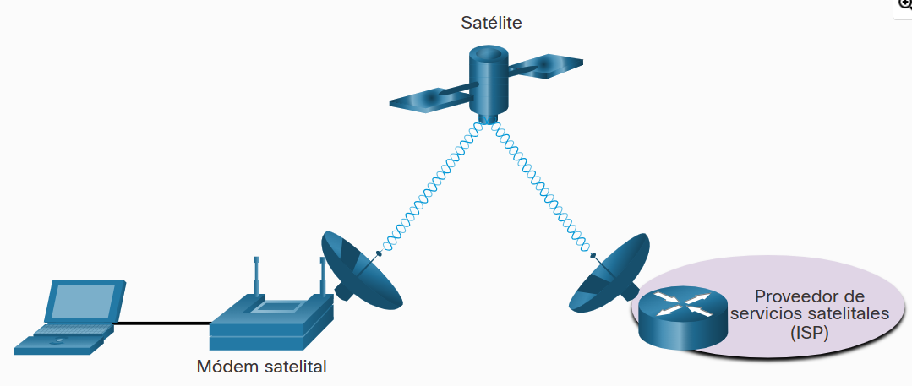

# Opciones de Conectividad al ISP

## Servicios del ISP (Proveedor de Servicios de Internet)

Un Proveedor de Servicios de Internet (ISP) constituye el eslabón entre la red doméstica y la Internet. Un ISP puede ser el proveedor de cable local, un proveedor de servicio de telefonía fija, la red celular que brinda su servicio de teléfono inteligente o un proveedor independiente que alquila ancho de banda en la infraestructura de red física de otra empresa.

Los ISP son fundamentales para las comunicaciones a través de la red global de Internet. Cada ISP se conecta a otros ISP para formar una red de enlaces que interconectan usuarios en todo el mundo. Los ISP están conectados de una manera jerárquica que garantiza que el tráfico de Internet generalmente tome el camino más corto desde el origen hasta el destino.

La red troncal de Internet es como una súper autopista de la información que proporciona enlaces de datos de alta velocidad para conectar las diversas redes de proveedores de servicios en las principales áreas metropolitanas de todo el mundo. El medio principal que conecta la red troncal de Internet es el cable de fibra óptica. Generalmente, este cable se instala bajo tierra para conectar ciudades dentro de un continente. Los cables de fibra óptica también se tienden bajo el mar para conectar continentes, países y ciudades

## Conexiones de ISP

La interconexión de los ISP que conforman la red troncal de Internet es una red compleja de cables de fibra óptica con conmutadores y enrutadores de red costosos que dirigen el flujo de información entre los hosts de origen y de destino. Los usuarios domésticos promedio no conocen la infraestructura fuera de su red. Para un usuario doméstico, la conexión al ISP es un proceso bastante simple.

## Conexiones de Cable y DSL

La mayoría de los usuarios de redes domésticas no se conectan a sus proveedores de servicios con cables de fibra óptica

- Cable - Por lo general, es un servicio ofrecido por proveedores de servicios de televisión por cable. La señal de datos de Internet se transmite a través del mismo cable coaxial que transporta la señal de televisión por cable. Esta opción proporciona una conexión a Internet siempre activa y de un ancho de banda elevado. Se utiliza un módem por cable especial que separa la señal de datos de Internet de las otras señales que transporta el cable y proporciona una conexión Ethernet a un equipo host o a una LAN.
- DSL - La Línea de Suscriptor Digital proporciona una conexión a Internet siempre activa y de un ancho de banda elevado. Requiere un módem de alta velocidad especial que separa la señal DSL de la señal telefónica y proporciona una conexión Ethernet a un equipo host o a una LAN. La señal DSL se transmite a través de una línea telefónica, que está dividida en tres canales. Uno de los canales se utiliza para llamadas telefónicas de voz. Este canal permite que una persona reciba llamadas telefónicas sin desconectarse de Internet. El segundo es un canal de descarga más rápido y se utiliza para recibir información de Internet. El tercer canal se utiliza para enviar o subir información. Por lo general, este canal es un poco más lento que el canal de descarga. La calidad y velocidad de la conexión DSL depende principalmente de la calidad de la línea telefónica y de la distancia desde la oficina central de su compañía telefónica. Cuanto más lejos esté de la oficina central, más lenta será la conexión.

## Opciones de Conectividad Adicionales

- rede celular
- satelital
- telefono de marcacion

En áreas metropolitanas, muchos departamentos y oficinas pequeñas se conecten directamente mediante cables de fibra óptica. Esto permite que los proveedores de servicios de Internet proporcionen velocidades de ancho de banda más elevadas y admitan más servicios, como internet, teléfono y TV.

## Resumen

### clientes y servidores

Todas las PC conectadas a una red que participan directamente en las comunicaciones de la red se clasifican como hosts. Los hosts pueden enviar y recibir mensajes a través de la red. En las redes modernas, las computadoras que son hosts pueden actuar como clientes, servidores o ambos. El software instalado en la computadora determina cuál es la función que cumple la computadora.

El software de servidor y el de cliente normalmente se ejecutan en computadoras distintas, pero también es posible que una misma computadora los ejecute a ambos a la vez. En pequeñas empresas y hogares, muchas PC funcionan como servidores y clientes en la red. Este tipo de red se denomina red P2P (peer-to-peer o redes entre pares). En empresas más grandes, en las que el tráfico de red puede ser intenso, con frecuencia es necesario tener servidores dedicados para poder responder a la gran cantidad de solicitudes de servicio. Las redes P2P son fáciles de configurar, menos complejas, de menor costo y se pueden usar para tareas simples como transferir archivos y compartir impresoras. Sin embargo, no existe una administración centralizada. Tienen menos seguridad, no son escalables y pueden funcionar más lento.

### componentes de red

Hay símbolos que representan varios tipos de equipos de red. La infraestructura de red es la plataforma que da soporte a la red. Proporciona el canal estable y confiable por el cual se producen las comunicaciones. La infraestructura de red contiene tres categorías de componentes de hardware: dispositivos finales, dispositivos intermedios y medios de red. Por lo general, el hardware está compuesto por los componentes visibles de la plataforma de red, como una PC portátil, una PC, un switch, un router, un punto de acceso inalámbrico o el cableado que se utiliza para conectar estos dispositivos. Los componentes que no son visibles incluyen medios inalámbricos.
Los dispositivos finales, o hosts, forman la interfaz entre los usuarios y la red de comunicación subyacente. Algunos ejemplos de dispositivos finales incluyen:

- Computadores (estaciones de trabajo, PC portátiles, servidores de archivos, servidores web)
- Impresoras de red
- Teléfonos y equipo de teleconferencias
- Cámaras de seguridad
- Dispositivos móviles (como teléfonos inteligentes, tabletas, PDA y lectores de tarjetas de crédito/débito inalámbricos y lectores de códigos de barras)

## opciones de conectividad

Un Proveedor de Servicios de Internet (ISP) constituye el eslabón entre la red doméstica y la Internet. Un ISP puede ser el proveedor de cable local, un proveedor de servicio de telefonía fija, la red celular que brinda su servicio de teléfono inteligente o un proveedor independiente que alquila ancho de banda en la infraestructura de red física de otra empresa. Cada ISP se conecta a otros ISP para formar una red de enlaces que interconectan usuarios en todo el mundo. Los ISP están conectados de una manera jerárquica que garantiza que el tráfico de Internet generalmente tome el camino más corto desde el origen hasta el destino.

La interconexión de los ISP que conforman la red troncal de Internet es una red compleja de cables de fibra óptica con conmutadores y enrutadores de red costosos que dirigen el flujo de información entre los hosts de origen y de destino.

Para un usuario doméstico, la conexión al ISP es un proceso bastante simple. Esta es la opción de conexión más común. Consiste en utilizar un enrutador integrado inalámbrico para conectarse al ISP. El enrutador incluye un conmutador para conectar hosts cableados y un AP inalámbrico psara conectar hosts inalámbricos. El enrutador también proporciona información de direccionamiento IP del cliente y seguridad para los hosts internos. Los dos métodos más comunes son cable y DSL. Otras opciones incluyen telefonía celular, satelital y telefónica.
